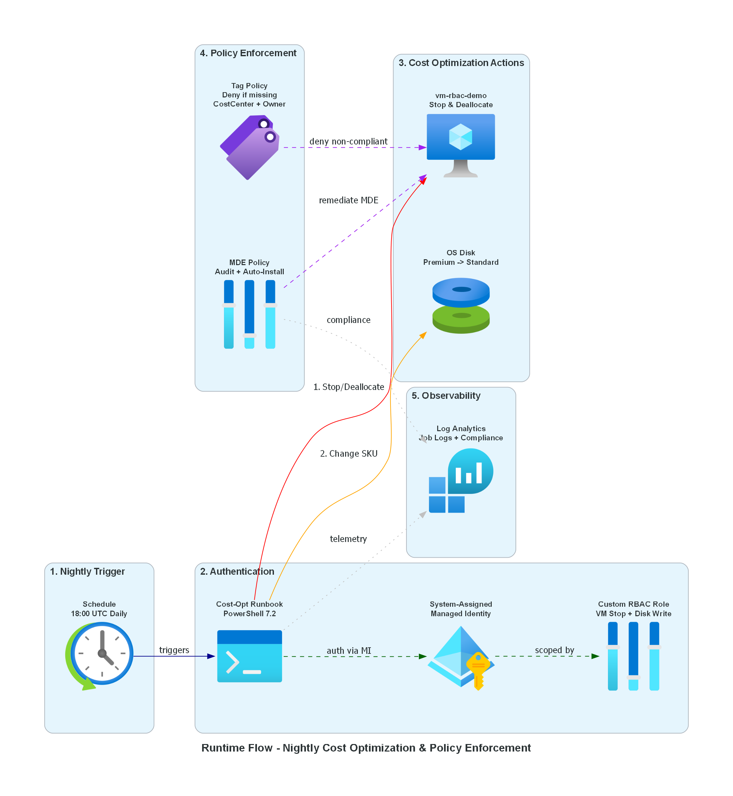

# Azure RBAC & Policy Cost Optimization Demo

This project demonstrates how **Azure RBAC** (custom roles), **Managed Identities**, **Azure Automation**, and **Azure Policy** work together to enforce governance, security, and cost optimization in Azure.

## What It Does

A daily Azure Automation runbook authenticates via a **system-assigned Managed Identity** to:

1. **Stop and deallocate** a Windows Server VM at 18:00 UTC
2. **Downgrade the OS disk** from Premium SSD to Standard HDD — saving costs during off-hours

A **custom RBAC role** restricts the Automation Account to only these specific actions (least-privilege). **Azure Policy** enforces tagging governance (CostCenter + Owner tags) and audits/auto-remediates Microsoft Defender for Endpoint on VMs.

### Key Highlights

- **Zero credentials stored** — Managed Identity eliminates secrets and service principals
- **Least-privilege RBAC** — Custom role allows only VM stop/deallocate and disk SKU changes
- **Policy enforcement** — Deny resource creation without required tags, auto-install MDE
- **Observability** — Log Analytics captures Automation job logs and policy compliance

## Architecture



### Resources Deployed

| Resource | Details |
|---|---|
| Virtual Machine | Standard_B2s, Windows Server 2022, Premium SSD |
| Automation Account | System-assigned Managed Identity, PowerShell 7.2 runbook |
| Custom RBAC Role | VM powerOff, deallocate, disk write (RG scope) |
| Azure Policy | Deny missing tags, audit MDE, deployIfNotExists MDE |
| Log Analytics | Automation diagnostics + policy compliance |
| Networking | VNet + Subnet + NSG + Public IP |

## Prerequisites

- An Azure subscription
- [Azure Developer CLI (azd)](https://learn.microsoft.com/azure/developer/azure-developer-cli/install-azd) installed
- PowerShell 7+ (for post-provision hooks)

## Deploy

### Option 1: Azure Cloud Shell

1. Open [Azure Cloud Shell](https://shell.azure.com) (PowerShell)

2. Clone the repository:
   ```bash
   git clone https://github.com/koenraadhaedens/azd-rbac-policy-demo.git
   cd azd-rbac-policy-demo
   ```

3. Log in and initialize:
   ```bash
   azd auth login
   azd init
   ```

4. Provision and deploy:
   ```bash
   azd up
   ```

5. Follow the prompts to select your subscription, region, and provide environment values.

### Option 2: Local PC with VS Code

1. Install the prerequisites:
   - [VS Code](https://code.visualstudio.com/)
   - [Azure Developer CLI](https://learn.microsoft.com/azure/developer/azure-developer-cli/install-azd)
   - [Bicep extension for VS Code](https://marketplace.visualstudio.com/items?itemName=ms-azuretools.vscode-bicep)

2. Clone and open the project:
   ```powershell
   git clone https://github.com/koenraadhaedens/azd-rbac-policy-demo.git
   code azd-rbac-policy-demo
   ```

3. Open a terminal in VS Code and run:
   ```powershell
   azd auth login
   azd init
   azd up
   ```

4. Follow the prompts to select your subscription and region.

### What Happens During Deployment

1. **`azd up`** provisions all infrastructure via Bicep (subscription-scoped deployment)
2. A **post-provision hook** automatically uploads the PowerShell runbook, publishes it, and links the daily schedule

## Clean Up

To remove all deployed resources:

```bash
azd down --purge
```

## Project Structure

```
├── azure.yaml                  # azd project configuration
├── infra/
│   ├── main.bicep              # Subscription-scoped orchestrator
│   ├── main.bicepparam         # Parameter file
│   └── modules/
│       ├── monitoring.bicep    # Log Analytics Workspace
│       ├── network.bicep       # VNet + Subnet + NSG + Public IP
│       ├── vm.bicep            # Windows VM (B2s, Premium SSD)
│       ├── automation.bicep    # Automation Account + MI + Runbook + Schedule
│       ├── rbac.bicep          # Custom Role Definition + Role Assignment
│       ├── policy-definitions.bicep  # Custom policy definitions
│       └── policy-assignments.bicep  # Policy assignments + remediation
├── scripts/
│   ├── Stop-VM-ChangeDisk.ps1  # Runbook: stop VM + change disk SKU
│   └── post-provision.ps1      # Post-provision hook
```
